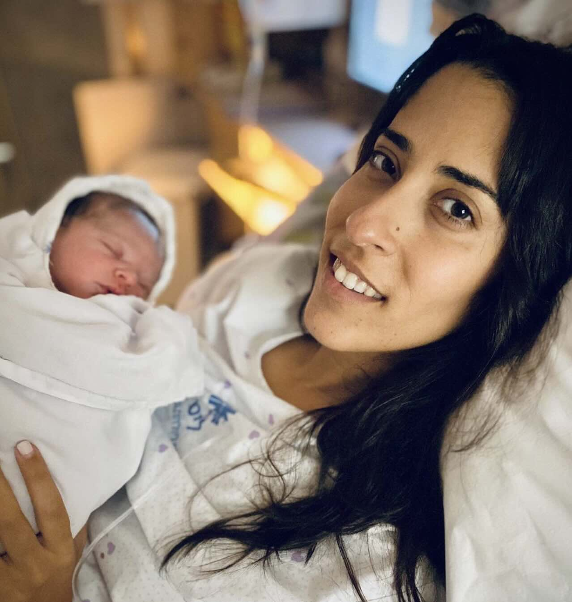

    <h3>Hello to 👩‍❤️‍💋‍👨 Raya & Lev 🥰</h3>
    
    <a href="index.html" class="back-button" style="display: inline-block; margin-top: 20px; padding: 15px 20px; background-color: #333; color: #fff; text-decoration: none; border-radius: 5px; font-size: 16px;">Waiting for the Next Bit 🤰</a>

