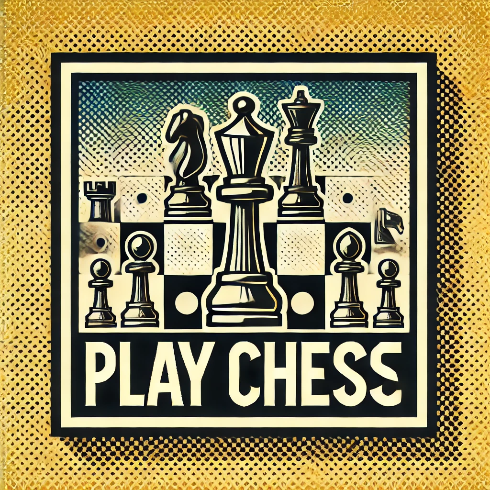

    <h1>Hello Alex, What do you want to do today?</h1>
    

        <a href="play-chess.html" class="option">
            
            Play Chess
        </a>
        <a href="code-like-a-monkey.html" class="option">
            
            Code like a Monkey
        </a>
        <a href="contemplate-dune.html" class="option">
            
            Contemplate Dune Philosophy
        </a>
        <a href="family-time.html" class="option">
            
            Family Time
        </a>
        <a href="something-silly.html" class="option">
            
            Something Silly
        </a>
    

